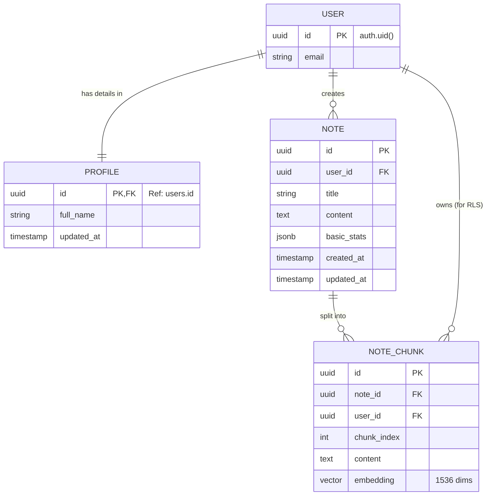

# Domain Model

## Overview
The domain model represents the core entities and their relationships within the Notes App ecosystem, bridging the connection between the React Native frontend and the PostgreSQL backend. It highlights the separation between standard relational data (Users, Notes) and the vector search components (Note Chunks).

## Entities

### 1. User (Auth)
Represents the authenticated identity managed by Supabase Auth.
* **Source**: `auth.users` (System Table)
* **Key Attributes**: `id` (UUID), `email`, `created_at`
* **Role**: The root owner of all data.

### 2. Profile
Stores application-specific user information distinct from authentication credentials.
* **Source**: `public.profiles`
* **Key Attributes**:
    * `id` (UUID): Primary Key, references `auth.users.id`.
    * `full_name` (Text): The user's display name.
* **Relationships**:
    * **1-to-1** with **User** (Shared Primary Key).

### 3. Note
The central entity representing a user's created content.
* **Source**: `public.notes`
* **Key Attributes**:
    * `id` (UUID): Unique identifier.
    * `title` (Text): The note's headline.
    * `content` (Text): The full body text.
    * `basic_stats` (JSONB): Metadata container (e.g., `{"word_count": 120, "char_count": 800}`).
    * `created_at` / `updated_at`: Timestamps.
* **Relationships**:
    * **Many-to-1** with **User**: A user owns multiple notes.
    * **1-to-Many** with **NoteChunk**: A note is split into multiple vector chunks.

### 4. Note Chunk
Represents a segment of a note processed for AI semantic search.
* **Source**: `public.note_chunks`
* **Key Attributes**:
    * `id` (UUID): Unique identifier.
    * `chunk_index` (Int): Order of the chunk within the note.
    * `content` (Text): The text segment used for embedding.
    * `embedding` (Vector[1536]): The OpenAI vector representation of the content.
* **Relationships**:
    * **Many-to-1** with **Note**: Belongs to a specific parent note.
    * **Many-to-1** with **User**: Direct link for efficient Row Level Security (RLS) filtering.

## Entity-Relationship Diagram (ERD)

## Design Decisions

### Vector Embeddings Strategy

Instead of storing embeddings directly on the `Note` table, we normalize them into `NoteChunk` entities.

  * **Reasoning**: Large notes may exceed the token limit for a single embedding model call. Splitting notes into chunks allows for more precise semantic search results (retrieving specific paragraphs rather than entire documents).

### JSONB for Stats

We use a `JSONB` column (`basic_stats`) on the `Note` entity.

  * **Reasoning**: This provides flexibility to add future metadata (e.g., "reading\_time", "sentiment\_score") without requiring database schema migrations for every new metric.

### Row Level Security (RLS)

All entities (`Profile`, `Note`, `NoteChunk`) are directly linked to `auth.users` via `id` or `user_id`.

  * **Reasoning**: This allows PostgreSQL RLS policies to automatically enforce security at the database layer, ensuring users can only query their own data.